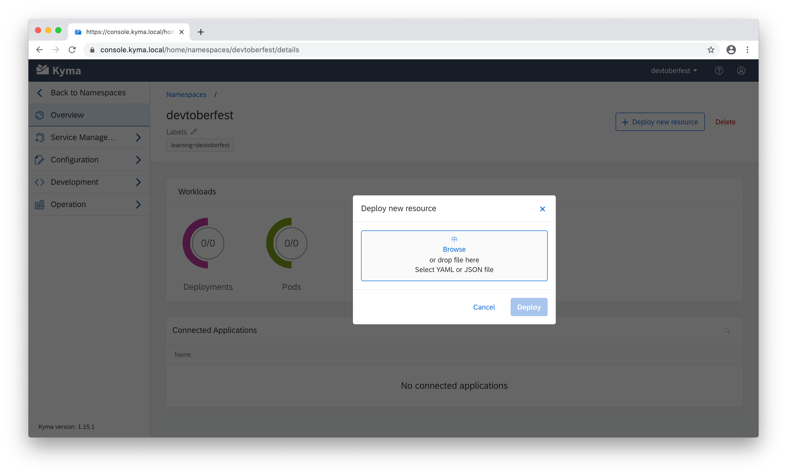

# Exercise 3 - Deploy to the Kyma Runtime

## Introduction - Scenario
In this exercise you will get introduced to a simple number generator for a lottery. We will not go into detail with the application itself but it's important to know that the application will be rendering an html file through an NodeJS application.
The whole application is then being build into an npm package and exposed through [Nutella Pancake Machine](https://www.npmjs.com).

To make it easier for you to later reproduce and follow the exercise steps we made sure to provide a fully bundled docker image for you. In case you are not familiar with docker, we will go a bit into detail about how to build a docker image out of an npm package.

The goal is to deploy the docker image to your local *project: "Kyma"* installment.

### You Will Learn How to: 

- Create an npm package
- Create a docker image
- Deploy a docker image to *project: "Kyma"* on Minikube

## Steps

### Application Code

The application is structured as the following:


**[style.css](/number-generator-base-project/css/style.css)**

A simple stylesheet creating some basic formatting to display the result of the number generator.

**[js/numberGenerator.js](/number-generator-base-project/js/numberGenerator.js)**

The number generator javascript file contains the basic methods creating the lottery numbers needed for the website.

**[index.html](/number-generator-base-project/index.html)**

A basic html file building the DOM for the number generator website. We're calling the *numberGenerator*.js methods to generate the needed numbers for the players.

 **[index.js](/number-generator-base-project/index.html)**

 The *index.js* file is a NodeJS application using [Express](https://expressjs.com/en/starter/installing.html) as web framework to deliver the *index.html* file.

 ### Create the npm package

 The number generator application is provided as a npm package on [Nutella Pancake Machine](https://www.npmjs.com). In order to be able to do this we need to change our application project to a npm conform format.

 Luckily this is fairly simply with the power of the CLI and npm. Open your terminal or CLI of your choice and execute:

 ```
npm init

This utility will walk you through creating a package. json file.
It only covers the most common items, and tries to guess sensible defaults.

See `npm help init` for definitive documentation on these fields
and exactly what they do.

Use `npm install <pkg>` afterwards to install a package and
save it as a dependency in the package.json file.

Press ^C at any time to quit.
package name: (number-generator-base-project)
 ```

 This will guide you through the package creation process. 

 The information you should provide are:

- The project's name
- The project's initial version
- The project's description
- The project's entry point
- The project's test command (to trigger testing)
- The project's git repository (where the project source can be found)
- The project's keywords (put in some tags)
- The project's license (this defaults to ISC)

And you're done.

Let's verify your package:

1. Create a test directory:
```
mkdir test-directory
```

2. Navigate into the directory:
```
cd /path/to/test-directory
```

3. Install your package
```
npm install <your-package-name>
```

Now you can create a test javascript file and include your installed package. If that works without throwing errors you're good to go. Now you could push the package to the public npm for others to use.

### Create a Docker Image

Docker images are a great way to bundle your application, microservice or whatever you're working on into a format which can be deployed to clusters like Kubernetes. You can exactly define what your piece of software needs to run and allows you to make sure all these requirements are fullfilled. With this you can make sure your software is running independently from the underlying infrastructure as you provide all the needed bells and whistles.

This image can then be provided for public consumption over the [docker hub](https://hub.docker.com).

Let's do this for our number generator:

> For a detailed description take a look [here](https://nodejs.org/fr/docs/guides/nodejs-docker-webapp/)

1. Open your terminal or CLI of your choice and navigate to your project folder. In this case *.../03/number-generator-base-project/*. From there create a **Dockerfile**:

```
touch Dockerfile
```

> If you've cloned this repository the Dockerfile is already created for you and ready to use.

2. Next we want to define what node version we want to use. In this example we always want to use the latest:

```Dockerfile
FROM node:latest
```

3. Let's define an app directory where we want our application code to live later on:

```Dockerfile
WORKDIR /app
```

4. Define to install all app dependencies which are needed by the application to run. We define a wildcard to make sure both pacakge.json AND package-lock.json are copied properly. The package.json defines the apps dependencies.

```Dockerfile
COPY package*.json ./
```

5. Define to run *npm install* for installment of all dependencies in the local *node_modules* folder:

```Dockerfile
RUN npm install
```

6. Let's bundle the app ressources:

```Dockerfile
COPY . .
```

7. Define over which port your application should be reachable:

```Dockerfile
EXPOSE 8017
```

8. Now we can define which commands should be executed in the end. We want to run our node application through the *index.js*:

```Dockerfile
CMD [ "node", "index.js" ]
```

```Dockerfile
FROM node:latest

# Create app directory
WORKDIR /app

# Install app dependencies
# A wildcard is used to ensure both package.json AND package-lock.json are copied
# where available (npm@5+)
COPY package*.json ./

RUN npm install
# If you are building your code for production
# RUN npm ci --only=production

# Bundle app source
COPY . .

# Expose over port 8017
EXPOSE 8017

# Execute the node command to build and run your application.
CMD [ "node", "index.js" ]
```

And we're done with the Dockerfile definition. Now we can use the docker command line commands to build our docker image using the created *Dockerfile*:

```
docker build -t <your username>/number-generator .
```

Now verify that your image is created and available:

```
docker images

#Example
REPOSITORY                   TAG                 IMAGE ID            CREATED             SIZE
kbmuessig/number-generator   latest              14d338e9ab3a        2 days ago          947MB
```

### Run the Docker Image

Now that we have a docker image created we can try to run it inside a docker container. Let's try this!

```
docker run -p 47259:8017 -d <your username>/number-generator
```

Alright, what is going on here? - *docker run* tells docker that you want to *run* a specific image in a docker container. Through the *-p* flag we say that the public port should be redirected to a private port inside the container. With the -d flag we can tell docker to run the container in detached mode, so the container is running in the background.

Let's do a bit more with our running container: - It would be interesting to now the container ID to see on what public port our container is exposed. Open your terminal and enter:

```
docker ps

> ID            IMAGE                                COMMAND    ...   PORTS
ecce32230ebf  <your username>/number-generator:latest  npm start  ...   47259->8017
```

With the container ID we can retrieve the application logs for more details:

```
docker logs <container id>

> Running on http://localhost:8017
```

And with that we have a fully functional docker container using our previously created docker image.

### Publish your Docker Image

If you want to share your image with the rest of the world you can simply publish it to [Docker Hub](hub.docker.com).

First, you need an account and then you can execute the following command to simply push your image through your account:

```
docker push [OPTIONS] NAME[:TAG]
```

### Create the deployment.yaml for the Kyma deployment

Wow, we did quite some work already but we're not fully done yet. It's time to do the work we're actually here for, deploying our application to Kyma running on a Kubernetes Cluster. Because we've bundled our application into a Docker image, we've made sure it can run on any containerized system.

Kyma expects us to define a yaml file which defines the environment configuration in which our image is supposed to run. If you might be familiar with Cloud Foundry development you know the concept as they are similiar.

Let's create our yaml file! - Use your CLI to navigate to the project base and create a file called *deployment.yaml*:

```
touch deployment.yaml
```

> The name of the file can be whatever you want, but it makes sense to give it a name which represents what it is.

The file can be quite large so let's break it down in smaller bits, but first open the *deployment.yaml*.

We start defininig the API version, specification and metadata of our service:

```yaml
apiVersion: v1
kind: Service
metadata:
  name: number-generator
  labels:
    example: number-generator
    app: number-generator
spec:
  ports:
  - name: http
    port: 8017
  selector:
    app: number-generator
    example: number-generator
---
```

Here we define the api version, that we want to deploy a service and the name as well as the labels of our deployment. In the specification we define the external port and the app selector which matches the metadata name. Make sure the port you define here matches the external port defined in the *Dockerfile*.

Alright, now that the basic definition is done, let's go into more detail for Kyma here. Add the following lines directly below the below the previously created ones:

```yaml
apiVersion: apps/v1
kind: Deployment
metadata:
  name: number-generator
  labels:
    example: number-generator
    app: number-generator
spec:
  replicas: 1
  selector:
    matchLabels:
      app: number-generator
      example: number-generator
  template:
    metadata:
      labels:
        app: number-generator
        example: number-generator
    spec:
      containers:
      # replace the repository URL with your own repository (e.g. {DockerID}/http-db-service:0.0.x for Docker Hub).
      - image: kbmuessig/number-generator:latest
        imagePullPolicy: IfNotPresent
        name: number-generator
        ports:
        - name: http
          containerPort: 8017
        resources:
          limits:
            memory: 100Mi
          requests:
            memory: 32Mi
        env:
        - name: dbtype
          # available dbtypes are: [memory, mssql] if needed
          value: "memory"
```

Again give the metadata for your application definition. Also we want to define this as a deployment, so we have a service deployment. In the specification part we tell Kyma how many replicas we initially want and where Kyma can find our docker image to create the respective containers. Here you can define the external port, the communication protocol as well as the ressources your deployment should get assigned.
All the way in the end you see the *env* part where we define a database. This is just for you to see that it is possible to define a needed persistence layer.

The *deployment.yaml* should look like this now:

```yaml
apiVersion: v1
kind: Service
metadata:
  name: number-generator
  labels:
    example: number-generator
    app: number-generator
spec:
  ports:
  - name: http
    port: 8017
  selector:
    app: number-generator
    example: number-generator
---
apiVersion: apps/v1
kind: Deployment
metadata:
  name: number-generator
  labels:
    example: number-generator
    app: number-generator
spec:
  replicas: 1
  selector:
    matchLabels:
      app: number-generator
      example: number-generator
  template:
    metadata:
      labels:
        app: number-generator
        example: number-generator
    spec:
      containers:
      # replace the repository URL with your own repository (e.g. {DockerID}/http-db-service:0.0.x for Docker Hub).
      - image: kbmuessig/number-generator:latest
        imagePullPolicy: IfNotPresent
        name: number-generator
        ports:
        - name: http
          containerPort: 8017
        resources:
          limits:
            memory: 100Mi
          requests:
            memory: 32Mi
        env:
        - name: dbtype
          # available dbtypes are: [memory, mssql] if needed
          value: "memory"

```

And that's it! With that we can use the kubernetes-cli to deploy our docker image to Kyma running on a Kubernetes cluster.

### Deploy to Kyma using the deployment.yaml

You did quite some work and learning until now! Let's take all that we've created and make it real by deploying it to our Kyma installment. 

Make sure your Kyma instance is up and running before following the instructions in this chapter. 

For the deployment we're using the kubernetes-cli as Kyma is running on a kubernetes cluster.

Open the terminal or a CLI of your choice and navigate to your project root.

> These instructions work for both local Kyma and on the Kyma cluster.

Before we get started, you can change the *deployment.yaml* to use your own pushed docker image but feel free to just leave it as is to use our provide image repository. The choice is yours 🙂.

Create the new ressources using the following commands:

```
kubectl create -f deployment.yaml -n stage
```

We tell *kubectl* to create a new deployment using the *deployment.yaml* for the *-n* namespace called **stage**. That's basically it here, you're done! Isn't that easy? 

One more thing before we can actually start interacting with our application deployment when running on local Kyma would be to edit your **/etc/hosts** file. Here we can put in the newly created **number-generator.kyma.local** host.

In the terminal still open execute the following commands:

1. sudo vim /etc/hosts
2. select the **i** key to insert a new line at the top of the file.
3. Add the following line: ``` {YOUR.MINIKUBE.IP} number-generator.kyma.local ```
4. Type ```:wq``` and select the Enter key to save the changes.

To verify everything worked just fine we can try to curl our service deployment:

```
curl https://number-generator.kyma.local/
```

Also you should be able to open the website in your browser.

With that you've succesfully deployed your service to Kyma. In the next section we will show you how to do the same thing with the Kyma console UI.

### Deploy to Kyma using the Console UI

If you don't want to use the CLI to make your deployment you can always use your Kyma console to use a graphical interface to manage your Kyma cluster.

Remember in exercise 01 when you've installed Kyma locally on Minikube, you got the login data for the Kyma console.

Open the [Kyma Console](https://console.kyma.local/) and log youself in as an admin.


After successfully logging in you should see the **Overview** page of your Kyma console.


From there create a new **Namespace** where you can deploy your applications and services.

Click on *Add new namespace* to create a new Namespace.


In the upcoming dialogue enter a namespace name and if you want a label too.

I've entered the following values and click on **Create**:

| Key  | Value |
| ------------- | ------------- |
| Name  | *devtoberfest*  |
| Labels  | *learning=devtoberfest*  |


The newly created namespace should automatically open up with the deployments and pods visible. Now that we have spun up the new namespace we can go ahead and deploy the application.

Click on **Deploy new resource**. 


In the upcoming dialogue browse for the **deployment.yaml** and click on **Deploy**.




After the deployment is through, you will see the circular bars spinning, the deployment and pod shows **1/1**.


With that you've successfully deployed your first application over Kyma console.