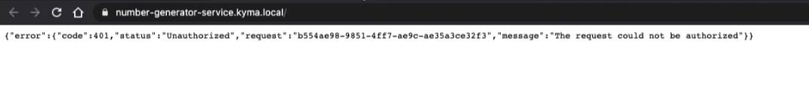

# Exercise 4 - Expose your Service through an Oauth2 secured API


## Introduction - Scenario
In this exercise you will get introduced to the Serverless functionality of Kyma and how to expose them via OAuth2 secured API. 
This exercise will continue to use our web application created in the previous exercise, it will be modified replacing the local functions to call the new Kyma Serverless Services exposed.
The exercise 4, also generated a ready to use Docker image of the web application, which can led you to focus on the Kyma activities

The goal is to create new Serverless functions and secure them via OAuth2 API using your *project: "Kyma"* installation.

### You Will Learn How to: 

- Create an Serverless service in the *project: "Kyma"*
- Create an OAuth2 client credentials
- Configure a Serverless service to be authenticated using OAuth2 

## Steps

### Create a new folder structure to comprise the new Kyma Serverless Services
To separate responsibilities, we will create a new folder structure that will contain the configurations and source code related to the new Services exposed in Kyma. In that manner, we will have different projects that can evolve and be versioned separately.

The new project folder will have a structure like the following:


  

### Create the deployment.yaml for the new services Kyma deployment

Previous exercise has two functions that are:
- generateNumber: Responsible to generate a random number
- generate: Responsible to generate five numbers, reutilizing the generateNumber function 

We will create two new services, one for each of them, in Kyma using the Serverless Lambda functions.

Let's create our new yaml in the src folder, containing the new service file! - Use your CLI to navigate to the project base and create a file called *deployment.yaml*:

```
touch deployment.yaml
```

> The name of the file can be whatever you want, but it makes sense to give it a name which represents what it is.


```yaml
apiVersion: serverless.kyma-project.io/v1alpha1
kind: Function
metadata:
  name: number-generator-service
  labels:
    app: number-generator-service
    exercise: excercise04
spec:
  deps: |
    {
      "name": "number-generator-service",
      "version": "1.0.0"      
    }
  labels:
    app: number-generator-service
  source: |
    module.exports = {
      main: function(event, context) {
        var powerballNumber = Math.ceil(Math.random(0, 1) * 69).toString();
        return powerballNumber;
      }
    }
  minReplicas: 1
  maxReplicas: 1
  resources:
    limits:
      cpu: 100m
      memory: 128Mi
    requests:
      cpu: 100m
      memory: 100Mi
---
```
Here we define the API version, w**hich in this case, is related to the serverless API of Kyma. The following information determines Kyma to the provision of the new service:
- metadata containing the name of the new service, labels, and app selector
- Specs contain the core information to create this new service. The source uses javascript with the syntax of Node.js programming language. Declare any external library that your code consumes into the deps section. This example does not call any external library, but use a descriptor declaration for the service, as a good practice for documentation
- resources and scaling are applied to the Kyma provisioning and allows Kyma to limit resource utilization 

As you can see, the source code used in this Serverless function is the same previously implemented on the web app, but now is exposed as a service and reusable.
Let's deploy the service.

Create the new resources using the following commands that defined the namespace devktoberfest:

```
kubectl apply -f deployment.yaml -n devktoberfest
```

Kyma will provision a new Pod containing your function.
To monitor the state of the new service you can use the following kubectl command:

```
kubectl get functions number-generator-service -n devktoberfest
kubectl get functions numbers-generator-service -n devktoberfest

NAME                  CONFIGURED   BUILT   RUNNING   VERSION   AGE
number-generator-service   True         True    True      1         48s

```

As soon as you can see a new service Running, it is available to be consumed by any Kyma internal system, another Serverless or microservices deployed and running in the same namespace.
By default, Kyma will provide the service using the following DNS composition <service-name>.<kyma-cluster-dns>. For local scenarios using minikube, this service is available via http://poweball-generator.kyma.local, or the name of the service using the namespace as DNS, for example, http://poweball-generator.devktoberfest, both will be running locally at HTTP port 80. 

Since the number generation service is now available for internal consumption, let's create the service that provides 5 random numbers, consuming exactly this service that we just created.

Open the same deployment.yaml file and add the following lines to the end:

```yaml
apiVersion: serverless.kyma-project.io/v1alpha1
kind: Function
metadata:
  name: numbers-generator-service
  labels:
    app: numbers-generator-service
    exercise: excercise04    
spec:
  deps: |
    {
      "name": "numbers-generator-service",
      "version": "1.0.0",
      "dependencies": {
        "axios": "0.20"
      }            
    }
  labels:
    app: numbers-generator-service  
  source: |
    module.exports = {
      main: async function(event, context) {
        const axios = require('axios');
        const apiURL = 'http://number-generator-service.devktoberfest';
        
        let generatedNumbers = [];
        var numberOfInteractions = 5;
      
          for (i = 0; i < numberOfInteractions; i++) {
            const response = await axios.get(apiURL).then(resp => {
                generatedNumbers.push(resp.data);                  
                return resp.data;
            });
        }
        return JSON.stringify(generatedNumbers);
      }
    }
  minReplicas: 1
  maxReplicas: 1
  resources:
    limits:
      cpu: 100m
      memory: 128Mi
    requests:
      cpu: 100m
      memory: 100Mi
---
```

Let's analyse the small difference between this new numbers-generator-service service and the previous one.
The numbers-generator-service add two small changes:
_ Add a section "dependencies" inside the spec section, and put the library Axios that be available for consumption inside the service.
- In the source section, you are able to see the URL for the number-generator-service service declared and being consumed 5 times in a loop

The last call of the lambda transforms the content of the Array variable into JSON format to be consumed by our web app lately.

Your *deployment.yaml* should look like this now:   

```yaml
apiVersion: serverless.kyma-project.io/v1alpha1
kind: Function
metadata:
  name: number-generator-service
  labels:
    app: number-generator-service
    exercise: excercise04
spec:
  deps: |
    {
      "name": "number-generator-service",
      "version": "1.0.0"      
    }
  labels:
    app: number-generator-service
  source: |
    module.exports = {
      main: function(event, context) {
        var powerballNumber = Math.ceil(Math.random(0, 1) * 69).toString();
        return powerballNumber;
      }
    }
  minReplicas: 1
  maxReplicas: 1
  resources:
    limits:
      cpu: 100m
      memory: 128Mi
    requests:
      cpu: 100m
      memory: 100Mi
---
apiVersion: serverless.kyma-project.io/v1alpha1
kind: Function
metadata:
  name: numbers-generator-service
  labels:
    app: numbers-generator-service
    exercise: excercise04    
spec:
  deps: |
    {
      "name": "numbers-generator-service",
      "version": "1.0.0",
      "dependencies": {
        "axios": "0.20"
      }            
    }
  labels:
    app: numbers-generator-service  
  source: |
    module.exports = {
      main: async function(event, context) {
        const axios = require('axios');
        const apiURL = 'http://number-generator-service.devktoberfest';
        
        let generatedNumbers = [];
        var numberOfInteractions = 5;
      
          for (i = 0; i < numberOfInteractions; i++) {
            const response = await axios.get(apiURL).then(resp => {
                generatedNumbers.push(resp.data);                  
                return resp.data;
            });
        }
        return JSON.stringify(generatedNumbers);
      }
    }
  minReplicas: 1
  maxReplicas: 1
  resources:
    limits:
      cpu: 100m
      memory: 128Mi
    requests:
      cpu: 100m
      memory: 100Mi
```
 
### Expose both services via OAuth2

We've just seen the magic happens; a simple YAML file can be ready to be consumed by the other applications and systems without any additional infrastructure concern. Kyma has made all for you.
Until now, any internal Serverless function or microservice can make calls to our new services, but they are still not published to the external systems.
This section will present to you how to configure our services to be exposed and secured via OAuth2.

Let's create our new yaml in the src folder, but with different names, like the authentication mode of the services, do not interfere with the source code or behavior! - Use your CLI to navigate to the project base and create a file called *security-functions.yaml*:

The purpose of the new YAML files is to create objects of kind APIRule, that will be applied to our services and guarantee their authentication mode.

```
touch security-functions.yaml
```

```yaml
apiVersion: gateway.kyma-project.io/v1alpha1
kind: APIRule
metadata:
  name: number-service-apirule
spec:
  gateway: kyma-gateway.kyma-system.svc.cluster.local
  service:
    name: number-generator-service
    port: 80
    host: number-generator-service
  rules:
    - path: /.*
      methods: ["GET"]
      accessStrategies:
        - handler: oauth2_introspection
          config:
            required_scope: ["read"]
---
apiVersion: gateway.kyma-project.io/v1alpha1
kind: APIRule
metadata:
  name: numbers-service-apirule
spec:
  gateway: kyma-gateway.kyma-system.svc.cluster.local
  service:
    name: numbers-generator-service
    port: 80
    host: numbers-generator-service
  rules:
    - path: /.*
      methods: ["GET"]
      accessStrategies:
        - handler: oauth2_introspection
          config:
            required_scope: ["read"]     
```

Getting more in-depth on the YAML declared above, we will have the following essential tags:
* Name, it is inside the metadata structure, will define the name of the object inside the Kyma cluster
* Section service attaches the new Secure Rule to the service that it will apply. The port and host are also important, and as mentioned in the previous section, the default port is HTTP 80, and for those, there is running local Kyma cluster with minikube, the DNS will be <kyma.local>
* In the section Rules, are declared the paths which the rule is valid; Methods defines the HTTP methods under this rule, and the handler, in our case, we will utilize oauth2_introspection handler, is mandatory define the required scope that the OAuth2 credential must provide

Apply the security-functions.yaml to your Kyma cluster, in the same namespace that service is running using the following command:

```
kubectl apply -f security-functions.yaml -n devktoberfest
```

Now Kyma has exposed both services using HTTPS protocol with OAuth2 authentication. If you try to open the URL https://numbers-generator-service.kyma.local in your browser, you will see the following message saying that the request is Unauthorized.

We tell *kubectl* to create a new deployment using the *security-functions.yaml* for the *-n* namespace called **devktoberfest**.  

One more thing before we can actually start interacting with our services APIs when running on local Kyma would be to edit your **/etc/hosts** file. Here we can put in the newly created **number-generator-service.kyma.local** and **numbers-generator-service.kyma.local** host.

In the terminal still open execute the following commands:

1. sudo vim /etc/hosts
2. select the **i** key to insert a new line at the top of the file.
3. Add the following line: ``` {YOUR.MINIKUBE.IP} number-generator-service.kyma.local ```
4. Add the following line: ``` {YOUR.MINIKUBE.IP} numbers-generator-service.kyma.local ```
5. Type ```:wq``` and select the Enter key to save the changes.

To verify that everything worked just fine we can try to curl our service deployment:

```
curl -ik https://number-generator-service.kyma.local/
curl -k https://numbers-generator-service.kyma.local/
```

Also you should be able to open the website in your browser.

You will see the following response for each service:

The new services are exposed, but controlled by authentication service. Let's work on that on the next section.




### Creating  OAuth2 Client Credentials

You are almost there!!! You have created the services, exposed them, have tried to use it, but fail, because you still don't have credentials to do that.

In this section we will present to you, how to create the OAuth2 Client Credentials and how to use them to get access to your new Services exposed.

Once again, we will practice creating YAML files to create a new OAuth2Client object in the Kyma cluster.
As the client credential is related to a configuration, let's create the YAML file inside the folder config with the name credentials.yaml.

```
touch credentials.yaml
```

To create a new OAuth2 client credential, you need to take into consideration the scope and the grant type that this client secret will provide

```yaml
apiVersion: hydra.ory.sh/v1alpha1
kind: OAuth2Client
metadata:
  name: number-generator-client
spec:
  grantTypes:
    - "client_credentials"
  scope: "read"
  secretName: number-generator-client
```

For this exercise we are creating a new OAuth2Client with the name *number-generator-client*

When you create a new OAuth2Client you can also provides the client_id and the client_secret, for the purpose of this exercise, we will let Kyma generate a secured keys.

Let's apply the configuration to create the new OAuth2Client. Go to your CLI and execute the following command:

```
kubectl apply -f credentials.yaml
```

#### Testing the credentials with the services

In this final step we gonna show you, how to obtain the client_id and client_secret generated by Kyma when you have created the OAuth2Client, as also, test the new Serverless functions authenticating them using the credentials.
Kyma provides via kubectl to get secret from specific name and namespace

Go to your CLI and let's retrieve the generated keys for the OAuth2Client.

1. Export as environment variables, the client name, namespace and domain that the OAuth2Client was create, like follows: 

```
export CLIENT_NAME=number-generator-client
export CLIENT_NAMESPACE=devktoberfest
export DOMAIN=kyma.local
```

2. Let's call the *kubectl get secret* command using the environment variables as parameter

```
export CLIENT_ID="$(kubectl get secret -n $CLIENT_NAMESPACE $CLIENT_NAME -o jsonpath='{.data.client_id}' | base64 --decode)"
export CLIENT_SECRET="$(kubectl get secret -n $CLIENT_NAMESPACE $CLIENT_NAME -o jsonpath='{.data.client_secret}' | base64 --decode)"
export ENCODED_CREDENTIALS=$(echo -n "$CLIENT_ID:$CLIENT_SECRET" | base64)
```

The command above uses the *-o jsonpath='{.data.client_id}'* that indicates to kyma that the output of the descriptor will be in the JSON format and will parse the attribute data.client_id.
With the same command the client_secret is retrieved from the OAuth2Client descriptor.

Kyma has the oauth2/token service API to authenticate and return you Bearer token that can be used in any other Serverlerss function that needs the OAuth2 authentication.
To generate  the credentials, the command is transforming the <client_id:client_secret> into base64 enconding and storing in the environment variable.

3. With the encoded credential in hands, let's call the Kyma OAuth2 service API to authenticate then. Execute the following command:

```
export TOKEN=$(curl -s -X POST "https://oauth2.$DOMAIN/oauth2/token" -H "Authorization: Basic $ENCODED_CREDENTIALS" -F "grant_type=client_credentials" -F "scope=read" | jq -r '.access_token')
echo $TOKEN
```
 
4. Now we have the proper Bearer token valid and authenticated, it has an expiration time and you can immediately call our serverlerss functions as showing below:

 ```
curl -ik -X GET https://numbers-generator-service.$DOMAIN/ -H "Authorization: bearer $TOKEN"
curl -ik -X GET https://number-generator-service.$DOMAIN/ -H "Authorization: bearer $TOKEN"
 ```

And you get to the final of the exercise 4 achieving all the initial goals that we have proposed.
The ````curl```` command uses the Bearer token to call our exposed services and the results are the execution of the randon code that we previously created

For validate all the exercises using our webapp, use our Docker image provided with the proper adapations. 

With this process, you have successfully completed the exercise 4, congratulations!!

