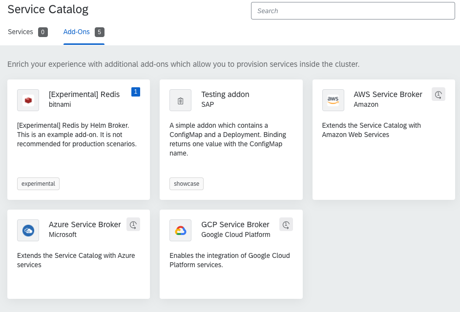

# Exercise 5 - Create extensions to get Additional Services

## Introduction - Scenario
In this exercise 5, you will learn how to add an Addon to your Kyma cluster. 
We will show you how to do this with a Redis Addon. 
With the add-on installed to your Kyma cluster, we will provide an instance of the Redis service. 
The Redis service instance will be bound to our previous Serverless function created, the numbers-generator-service. 
It will store the numbers generated by each call,  persisting it on the Redis instance, create a history that can be consumed via service later.

The main goal is to create an extension on Kyma and get additional services consumed by our previously lambda created.

### You Will Learn How to: 

- Add an Addon for Redis to the Catalog of the *project: "Kyma"*
- Create a new instance of the Addon 
- Bind the instance of the Redis Addon to the Serverless function
- Consume redis service to add and read keys inside the lambda

## Steps

### Create new deployment file for our AddOn

For this exercise, we will continue to use the project number-generator-service to store our kyma deployment files.
Let's create our new yaml in the src folder, containing the new addon definition file! - Use your CLI to navigate to the project base and create a file called *redisaddon.yaml*:

```
touch redisaddon.yaml
```

1. vim redisaddon.yaml
2. select the **i** key to insert a new line at the top of the file.
3. Add the following content to the file

```yaml 
apiVersion: addons.kyma-project.io/v1alpha1
kind: AddonsConfiguration
metadata:
  name: redis-addon
  namespace: devktoberfest
spec:
  reprocessRequest: 0
  repositories:
    - url: https://github.com/kyma-project/addons/releases/download/0.12.0/index-testing.yaml
```

4. Type ```:wq``` and select the Enter key to save the changes.

In the metadata section above, we are defining a new AddonsConfiguration object to kyma.
* We have defined the name as *redis-addon* into the devktoberfest namespace
* The definition of the redis service and provisioning is defined by the repositories tag, inside the spec, it is referring to the URL where the file index-testing.yaml file exists. 

5. To deploy our new addon, let's use kubectl command as following:

```
kubectl apply -f redisaddon.yaml -n devktoberfest
```

Don't forget to inform the namespace when you are applying the file. If you do not define the namespace in the kubectl command, it will take the definition from the yaml file, and if it's not defined either, then it will deploy your objects into the "default" namespace.
To check the status of Addon deployment type the following command:

```
kubectl get addons redis-addon -n devktoberfest -o=jsonpath="{.status.phase}"
```

The *status.phase* must be equal to *Ready* to start to use.
No, we have added to our AddOn catalog, an offer of a Redis service.
To be able to use the service we need to create a new Service Instance of the addon and binding it to our lambda services.

Open the Kyma Console UI and go to the Menu Catalog -> AddOns, then you can see the Redis offer as the image below:



### Create new Redis database instance

Let's create our new Redis service instance.

Edit our redisaddon.yaml file, and append the following metadata to the bottom of the service.

1. vim redisaddon.yaml
2. Go to the bottom of the file
3. select the **i** key to insert a new line at the top of the file.
4. Add the following content to the end of the file

```yaml
---
apiVersion: servicecatalog.k8s.io/v1beta1
kind: ServiceInstance
metadata:
  name: numbers-redis-service
  namespace: devktoberfest
spec:
  serviceClassExternalName: redis
  servicePlanExternalName: micro
  parameters:
    imagePullPolicy: Always
``` 

A Service Instance of our addon was defined with the name number-redis-service inside the devktoberfest namespace.
With this spec section we have to Kyma, that our Redis instance will use the *micro* service plan, that means that is a in-memory persistence. 

> The name of the service can be whatever you want, but it makes sense to give it a name which represents what it is.   

5. Type ```:wq``` and select the Enter key to save the changes.

> Remember that we need to use *---* line as a separator between the objects declaration inside the yaml file

6. Deploy the service instance to Kyma using the following command: 
 
```
 kubectl apply -f redisaddon.yaml -n devktoberfest
 ```

7. You can see the following output on the deployment

TODO: 
````shell script

````

8. Check the status of the service instance provisioning. This process can take more time, as it needs to download the image and configure everything.
Type the command

````shell script
kubectl get serviceinstance numbers-redis-service -n devktoberfest -o=jsonpath="{range .status.conditions[*]}{.type}{'\t'}{.status}{'\n'}{end}"
````

The last condition to the resource status is "Ready equals True".
If it is not ready yet, wait more seconds and execute the command again.

Open the Kyma Console UI and go to the Menu Instance -> AddOns, then you can see the Redis instance created as the image below:


### Create Service Bind to the Redis Service

After the provisioning of a new Redis instance service, is needed to have a ServiceBinding Kyma object, that is 
responsible to bound this Redis instance with any other services that you have created.

Edit our redisaddon.yaml file, and append the following metadata to the bottom of the service.

1. vim redisaddon.yaml
2. Go to the bottom of the file
3. select the **i** key to insert a new line at the top of the file.
4. Add the following content to the end of the file

```yaml
---
apiVersion: servicecatalog.k8s.io/v1beta1
kind: ServiceBinding
metadata:
  name: numbers-redis-servicebinding
  namespace: devktoberfest
spec:
  instanceRef:
    name: numbers-redis-service
``` 
5. Type ```:wq``` and select the Enter key to save the changes.

6. Deploy the service binding to Kyma using the following command: 
 
```
 kubectl apply -f redisaddon.yaml -n devktoberfest
```

This deployment descriptor, create a new object of kind ServiceBinding.
The metadata section, defined the name of the object as *number-redis-servicebinding*. 
In the spec section, the instanceRef tag was referred with the name of the Redis Service that we have created before, *number-redis-service*


7. Check the status of creation of the servicebinding object, executing the following command:
 
```shell script
 kubectl get servicebinding numbers-redis-servicebinding -n devktoberfest -o=jsonpath="{range .status.conditions[*]}{.type}{'\t'}{.status}{'\n'}{end}"
```

This *kubectl get* command, has defined that the output will be in the json format, this can facilitate the process
of parsing the result using regular expression to filter the condition and status attributes.

The last condition in the status should be Ready equals True:

TODO://
````shell script

````

Great!! The ServiceBinding object is created .

### Create Service Bind Usage to the Redis Service

We have created the Service Binding object, that now is attached to the Redis Service instance, now is time to connect our lambda service with that Redis service instance.

1. vim redisaddon.yaml
2. Go to the bottom of the file
3. select the **i** key to insert a new line at the top of the file.
4. Add the following content to the end of the file

```yaml
---
apiVersion: servicecatalog.kyma-project.io/v1alpha1
kind: ServiceBindingUsage
metadata:
  name: numbers-redis-bindingfunction
  namespace: devktoberfest
spec:
  serviceBindingRef:
    name: numbers-redis-servicebinding
  usedBy:
    kind: serverless-function
    name: numbers-generator-service
  parameters:
    envPrefix:
      name: "REDIS_"
``` 
5. Type ```:wq``` and select the Enter key to save the changes.

6. Deploy the service binding usage to Kyma using the following command: 
 
```shell script
 kubectl apply -f redisaddon.yaml -n devktoberfest
```

7. Check the status of creation of the ServiceBindingUsage object, executing the following command:
 
```shell script
 kubectl get servicebindingusage numbers-redis-bindingfunction -n devktoberfest -o=jsonpath="{range .status.conditions[*]}{.type}{'\t'}{.status}{'\n'}{end}"
``` 

The last condition in the status should be Ready equals True:

8. Check the secret credentials created by the number-redis-servicebinding object with the following command:

```shell script
 kubectl get secret numbers-redis-servicebinding -n devktoberfest -o go-template='{{range $k,$v := .data}}{{printf "%s: " $k}}{{if not $v}}{{$v}}{{else}}{{$v | base64decode}}{{end}}{{"\n"}}{{end}}'
``` 

You will be able to see the following output as result:

TODO://
````shell script

````
 
Let's get deeper into details of the configuration

In the metadata section, *numbers-redis-bindingfunction* was set as the name of the Service Binding Usage object.
The spec.serviceBindingRef and spec.usedBy fields are required. spec.serviceBindingRef field has been configured with the name of ServiceBinding that you have just created,
and spec.usedBy is set to the function numbers-generator-service, our lambda that generates random numbers. 
The usageBy also has the kind property, which is set to kind: serverless-function.
This combination will make Kyma, which defines how Secrets(credentials to connect on redis-service), should be injected to your Function when creating a ServiceBinding.

We still have the spec.parameters.envPrefix.name field, that is optional, but we are adding the prefix as REDIS_ in this exercise,
it will add this prefix to all environment variables injected into the Secret into our Serverless function when creating a new ServiceBinding

Everything is OK!! You have created the ServiceBindingUsage object, now our numbers-generator-service lambda can use and consume the Redis instance.

#### Check configuration in the Kyma Console UI

Open the Kyma Console UI, and then click on the left side in the Functions menu.
Select the numbers-generator-service, and click on it to see how it is configured.

At the bottom of the function definition, you can see that Kyma has injected the Secret credentials to the lambda functions.
These variables, can be used in your lambda code, to connect to the Redis service, and consume the database. It's great to see how Kyma
can provide to us, this flexibility on the configurations, and the secured that services have, no plain text password is stored or showed.


This variables, can be used in your lambda code, to connect to the Redis service, and consume the database. It's great to see how Kyma
can provide to us, this flexibility on the configurations, and the secured that services has, no plan text password is stored or showed.

Now, we are good to go, and change our lambda to connect on Redis Service.
 
### Change the Numbers Generator Service to store the history

Let's edit your first deployment.yaml file created that contains our lambda services.

1. vim deployment.yaml
2. Find for the numbers-generator-service
3. select the **i** key to insert a new line at the top of the file.
4. Change the *spec* section to looks like this

````yaml
spec:
  deps: |
    {
      "name": "numbers-generator-service",
      "version": "1.0.0",
      "dependencies": {
        "axios": "0.20",
        "redis": "3.0.2"
      }
    }
  labels:
    app: numbers-generator-service
  source: |
    module.exports = {
      main: async function(event, context) {
        const axios = require('axios');
        const redis = require('redis');

        const client = redis.createClient(
            {host: process.env.REDIS_HOST,
             port: process.env.REDIS_PORT,
             password: process.env.REDIS_REDIS_PASSWORD
             }
         );

        const apiURL = 'http://number-generator-service.devktoberfest';

        let generatedNumbers = [];
        var numberOfInteractions = 5;

          for (i = 0; i < numberOfInteractions; i++) {
            const response = await axios.get(apiURL).then(resp => {
                generatedNumbers.push(resp.data);
                return resp.data;
            });
        }

        returnArrayNumbers = JSON.stringify(generatedNumbers);

        //Use the new Redis Connection and insert the result of numbers into a list
        key = new Date().toISOString();
        client.set(key, returnArrayNumbers,
            function(err, reply) {
                console.log('Key: ' + key + ' inserted ' + reply);
            });

        return returnArrayNumbers;
      }
    }
  minReplicas: 1
  maxReplicas: 1
  resources:
    limits:
      cpu: 100m
      memory: 128Mi
    requests:
      cpu: 100m
      memory: 100Mi
````

5. Type ```:wq``` and select the Enter key to save the changes.

6. Deploy the changes of our Lambda Service to Kyma using the following command: 
 
```shell script
 kubectl apply -f deployment.yaml -n devktoberfest
```

Let's analyze the code per sections:
* In the dependencies, we have set a new entry to the redis library version 3.0.2, it allows to create a client connection with the Redis instance.
* In the source code we have created the following blocks
    * Object *redis* that is declared requiring the *redis* library
    * Object *client* using the method *redis.createClient()* using the ServiceBinding secret/credentials that were previously injected to this lambda, the HOST, PORT, PASSWORD are used to create a physical connection to our Redis instance 
    * At the end of code block, the object *client* is used to call the method *set()* storing the last numbers generated into the Redis database. For the example purpose, a new Date() is stored as a key for this record.

The key/value inserted on Redis generates simply logging of the result of the insertion.

The lambda service will start to Build, and deploy this new version.

### Create a new History Service Lambda 

While the lambda is in the deployment process, let's assume that we can quickly test that our Redis is appropriately populated.
The next step will create a new lambda function that just returns all the content of the Redis service instance.

Let's edit your first deployment.yaml file created that contains our lambda services.

1. vim deployment.yaml
2. Go to the bottom of the file
3. select the **i** key to insert a new line at the top of the file.
4. Add the following content to the end of the file

`````yaml
---
apiVersion: serverless.kyma-project.io/v1alpha1
kind: Function
metadata:
  name: numbers-history-service
  namespace: devktoberfest
  labels:
    app: numbers-history-service
    exercise: excercise05
spec:
  deps: |
    {
      "name": "numbers-history-service",
      "version": "1.0.0",
      "dependencies": {
          "ioredis": "4.18"
      }
    }
  labels:
    app: numbers-history-service
  source: |
    module.exports = {
      main: async function(event, context) {
        const Redis = require('ioredis');

        const redis = new Redis({
          port: process.env.REDIS_PORT,
          host: process.env.REDIS_HOST,
          password: process.env.REDIS_REDIS_PASSWORD
        });

        const keys = await redis.keys('*');
        const values = await redis.mget(keys);

        return JSON.stringify(values);
      }
    }
  minReplicas: 1
  maxReplicas: 1
  resources:
    limits:
      cpu: 100m
      memory: 128Mi
    requests:
      cpu: 100m
      memory: 100Mi
`````

In this new function, we are using the same Redis instance, creating a new client connection,
after this, we execute the Redis command to retrieve all keys to start to iterate.
Is a simple node.js code, listing all keys retrieved and pushing to the history Array, that at the end will be the return of the function

5. Type ```:wq``` and select the Enter key to save the changes.

6. Deploy the new numbers-history-service to Kyma using the following command: 
```shell script
 kubectl apply -f deployment.yaml -n devktoberfest
```

7. to show the function running lets use kubectl get function command
```shell script
 kubectl get function numbers-history-service -n devktoberfest
```

The following ouput will be showed:
TODO://
````shell script

````


#### Bind the Redis Service instance with the new History service

Our number-history service file is using the process.env properties to connect on our Redis service instance.
But until now, we didn't provide this bind to the number history service yet.

Let's create this binding, in the same way as we did before, for the numbers-generator

1. vim redisaddon.yaml
2. Go to the bottom of the file
3. select the **i** key to insert a new line at the top of the file.
4. Add the following content to the end of the file

````yaml
apiVersion: servicecatalog.kyma-project.io/v1alpha1
kind: ServiceBindingUsage
metadata:
  name: numbers-redis-binding-history
  namespace: devktoberfest
spec:
  serviceBindingRef:
    name: numbers-redis-servicebinding
  usedBy:
    kind: serverless-function
    name: numbers-history-service
  parameters:
    envPrefix:
      name: "REDIS_"
````

Here we have the same declaration of the ServiceBindingUsage object created before, but
we are changing a new, because is that a new one, and the usedBy entry, telling Kyma to bind to our last number-history-service created

5. Type ```:wq``` and select the Enter key to save the changes.

6. Deploy the new ServiceBindUsage object to Kyma using the following command: 
```shell script
 kubectl apply -f redisaddon.yaml -n devktoberfest
```

7. to show the servicebindingusage status lets use kubectl  command
```shell script
 kubectl get numbers-redis-binding-history numbers-redis-bindingfunction -n devktoberfest -o=jsonpath="{range .status.conditions[*]}{.type}{'\t'}{.status}{'\n'}{end}"
```


TODO://
````shell script

````

The *numbers-history-service* will be changed and redeployed with the new binding configuration. 

Great!!! One more step completed!!

#### Expose the History Service to be publicly available

Now the function is created, it is bound,  but not exposed yet. For the exercise, let's configure the new service to be
accessed without restrictions.

Let`s edit the file security-functions.yaml.

1. vim security-functions.yaml
2. Go to the bottom of the file
3. select the **i** key to insert a new line at the top of the file.
4. Add the following content to the end of the file

````yaml
---
apiVersion: gateway.kyma-project.io/v1alpha1
kind: APIRule
metadata:
  name: numbers-history-apirule
spec:
  gateway: kyma-gateway.kyma-system.svc.cluster.local
  service:
    name: numbers-history-service
    port: 80
    host: numbers-history-service
  rules:
    - path: /.*
      methods: ["GET"]
      accessStrategies:
        - handler: allow
````
With this configuration, we are exposing the service with the name number-history-service, with no handlers, allowing any GET HTTP connection

5. Type ```:wq``` and select the Enter key to save the changes.

6. Deploy the new APIRule object of the History Service to Kyma using the following command: 
```shell script
 kubectl apply -f security-functions.yaml -n devktoberfest
```

Done, new service already exposed!!! 

Remember that, when you are working with minikube, any new service must be declared into your /etc/hosts file, to be able to be locally resolved.
Open again your /etc/hosts file and let's add the new numbers-history-service to the minikube IP.

In the terminal still open execute the following commands:

1. sudo vim /etc/hosts
2. select the **i** key to insert a new line at the top of the file.
3. Add the following line: ``` {YOUR.MINIKUBE.IP} numbers-history-service.kyma.local ```
4. Type ```:wq``` and select the Enter key to save the changes.

To verify everything worked just fine we can try to curl our service deployment:

```shell script
 curl -ik https://numbers-history-service.kyma.local/
```

Excellent!! The configuration is ready. Let's test all services together.

#### Testing all scenario

Open your preferred browser and go the webapp number-generator accessing the URL https://number-generator.kyma.local/.
Click on the button *Click Me* more than one time.

Your window should look like these:


Open a new browser window or a new tab and go to our new history service accessing the URL https://numbers-history-service.kyma.local/.
Immediately the service will return the history of last numbers generated and your window should look like this:


Congratulations!!! You have succeeded to the end of our exercise 5.