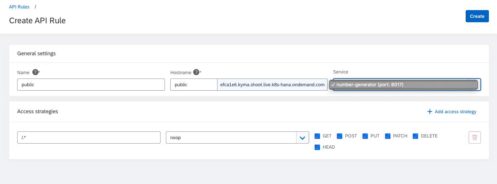

# Exercise 6 - Prepare your Kyma environment for Scale

## Introduction - Scenario
In this exercise you will learn the basics of scaling in Kyma. We will be using Kubernetes' built in featues to scale the application.
Additionally we will be using Kubernetes' "rolling restart" features to restart a scaled application under load. 
The Sample application in use is part of this source code repository and is already uploaded to Docker Hub. Deployment.yaml manifests have been adapted.

### Pre-Requisites
- working Kyma installation
- kubetctl commandline tools 
- activated kubeconfig to access the cluster via commandline. <br>
If you don't have comamndline tools then you still can study everything. Only Step 8) would not be possible.


### You Will Learn How to: 
- Scale your application and make use of Kubernetes' scaling features and the collaborative orchestration of Kyma's service mesh and API Rules
- What it means from Kubernetes and Kyma perspective if you scale down your application to zero replicas
- How to use Kubenetes' rolling restart feature to restart you app while keeping the current scaling settings

## Steps

### Application code
The application code is not building upon previous exercises. You can build and dockerize yourself or just use the prepated image together with the Deployment.yaml descriptor in the repository. 
If you want to dockerize and build the application yourself, please refer to the instructions in Exercise 03.


1) ### Create Your namespace

    Please create a namespace to isolate your workloads fom other exercises. <br>
    Name your namspace "exercise06".

    | # |Console  | Command Line  |
    |---|---|---|
    |Step 1| <br>*Namespaces -> Add new namespace*   |  ```$ kubectl create namespace exercise06``` |


2) ### Deploy the Application
    You can now deploy the application in your namespace. If you have created your namespace using the Console application then the namespsace is already activated. All resources you deploy now are scoped to your new namespace. 
    If you use command line, make sure you refer to the newly created namespace, otherwise the changes might be applied to the default one.

    | #| Console  | Command Line  |
    |---|---|---|
    | Step 1| <br>*Configuration -> Resources --> Deploy new resource   |  ```$ kubectl -n exercise06 apply -f deployment.yaml``` |
    | Step 2| <br>*Operation -> Deployments*|  ```$ kubectl -n exercise06 get deployments``` |
    | Step 3| <br>*Operation -> ReplicaSets*  |  ```$ kubectl -n exercise06 get replicasets``` |
    | Step 4| <br>*Operation -> Pods*  |  ```$ kubectl -n exercise06 get pods``` |
    | Step 5| <br>*Operation -> Services*  |  ```$ kubectl -n exercise06 get services``` |

3) ### Create API rule to expose the application to the public
    In order to expose the application to the public you can use the API Rule feature to quickly expose an ingress. We don't need any authentication nor authorization, hence, we will select the "noop" access strategy to simply pass through directly to our application.
    | #| Console  | Command Line  |
    |---|---|---|
    | Step 1| <br>*Configuration -> API Rules   |  ```$ kubectl -n exercise06 get apirules``` |
    | Step 2| <br>*Configuration -> API Rules --> Create API Rule*|  ```$ kubectl -n exercise06 apply apirule.yaml```|
    
4) ### Use the application
    You can now use the sample application. Since you have only one instance of it running, you will only see one histogram.<br>
    


5) ### Scale your deployment up
    Now you can edit your deployment in two ways:
    1) Using Console application in Operation -> Deployments. Just edit your deployment and change the "spec.replicas" value to an integer value > 1
    2) use kubectl apply to apply the target state of your change deployment.yaml file

6) ### Scale your deployment down
    Similar to Number 5 you can also scale your replicas down. Every integer value > 0 will produce a working deployment.<br>
    

7) ### Scale your deployment to zero
    If you change your deployment replcias to "0", then there would be no apps running in your upstream but the API rule is still intact. 

8) ### Practice and study rolling restart
    To study how the rolling restart feature of Kubernetes and Kyma work please:
    1) scale your application to 3 replicas
    2) Use the Sample app to produce some load using the "Click me for continuous number stram" button
    3) after some time multiple histograms are shown and are continuously updating
    4) initiate the rolling restart using kubectl commandline ```$ kubectl -n exercise06 rollout restart deployment number-generator``` <br>
    You would see new replicas and therefore new histograms appearing similar to this picture: <br>
    


I hope you enjoyed this tutorial. This is only the tip of the iceberg of all available operational features of Kubernetes and Kyma.